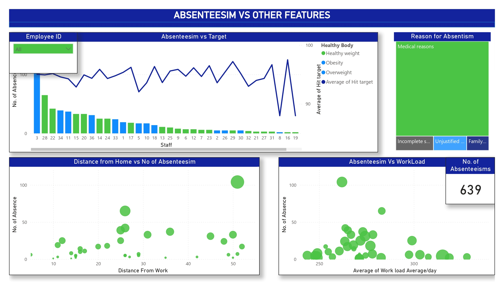

# Employees-Absenteeism-Analysis

#### Introduction

Welcome to the 'Employee Absenteeism Analysis' project, a collaborative effort aimed at exploring the factors contributing to employee absenteeism and designing effective interventions. This project delves into various lifestyle factors and leverages data analysis to provide actionable insights.

#### Objective

Our primary objective was to dissect employee absenteeism from multiple angles, considering factors such as health, commuting, job responsibilities, and social aspects. The ultimate goal was to reduce absenteeism rates and increase overall productivity.

## **Key Tasks and Accomplishments:**

I investigated and analyzed absenteeism trends in a medium-sized company and presented findings and recommendations to stakeholders. The followin tasks was carried out:

- I conducted data cleaning, transformation, and analysis on the Human Resources Absenteeism dataset using Power-Query and DAX.

- I developed a 3 page Power BI dashboard that effectively visualizes and communicates absenteeism trends and insights to stakeholders.

**Overall, this project demonstrated my ability to leverage data analytics tools and techniques to identify key insights and drive meaningful improvements in organizational performance.**

## **Here is what the dashboard looks like:**

#### **Absenteeism Dashboard:**

#### **Absenteeism Dashboard:**

#### **Employee Performance Dashboard:**

1. **Absence from Given Reasons**: This section helps us understand the given reasons behind work absences. It reveals that out of the total given reasons, medical reasons dominate, accounting for over 87% of employee absences. This highlights the importance of the organization focusing on employee health and well-being. To reduce absenteeism, the organization can implement initiatives such as wellness programs, regular health check-ups, and stress management workshops. These measures can significantly improve employees' general health and reduce the frequency of medical-related absences. By prioritizing employee health, the organization can create a more productive and supportive work environment.

2. **Absence by Seasons**: This analysis helps us determine whether seasonal attributes contribute to the reasons for absence, especially medical reasons. The analysis reveals a similar range of absenteeism across the different seasons, indicating that there is no significant seasonal influence on the reasons for absence. This finding suggests that the number of absenteeism remains relatively consistent throughout the year, irrespective of the season.
   
3. **Absence by Educational Level**: The data reveals a significant level of absence among high school-educated employees, indicating a higher prevalence of absences in this group. This suggests that the organization may need to pay extra attention to employees with a high school education when addressing absenteeism. To address this issue, conducting orientation seminars to sensitize these employees about the benefits of regular attendance and the importance of maintaining good health can be beneficial. Providing educational resources on managing medical conditions and promoting a healthy work-life balance can also be helpful. By focusing on these aspects, the organization can better support high school-educated employees and reduce absenteeism in this group.
   
4. **Absence by Social Habit**: The data analysis shows a relatively balanced absence rate among employees based on their drinking habits, with drinkers representing 52 percent and non-drinkers accounting for 48 percent. This indicates that drinking may not be a significant contributor to employee absenteeism.

5. **Absence by Body Mass**: The distribution of absence across different body mass categories reveals a compelling pattern. Although absenteeism is fairly evenly distributed among various body mass groups, it's noteworthy that a significant portion of absences occurs among obese, normal weight, and overweight employees. This points to an opportunity for the organization to implement programs aimed at promoting healthy weight management for obese and overweight employees, which can improve overall health and boost attendance, particularly considering that the majority of absenteeism is attributed to medical reasons. Additionally, a deeper analysis of normal-weight employees uncovered that their absences are often linked to family-related factors, highlighting the need for tailored strategies to enhance their presence in the workplace.

These insights provide a valuable foundation for HR and management to make data-driven decisions and implement strategies to address specific factors influencing employee absenteeism

#### Conclusion

The outcome of our efforts was a remarkable achievement: a significant reduction in absenteeism rates and a substantial increase in overall productivity, demonstrating the profound impact of our research and interventions.
